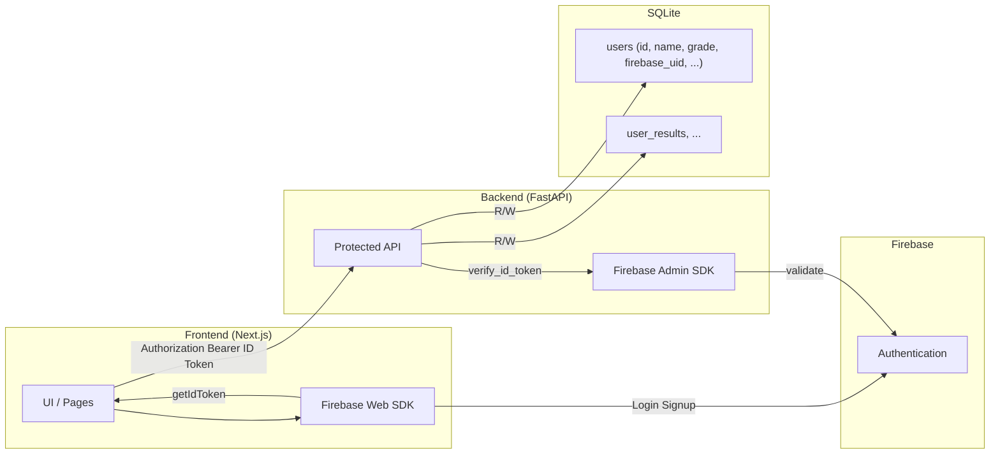
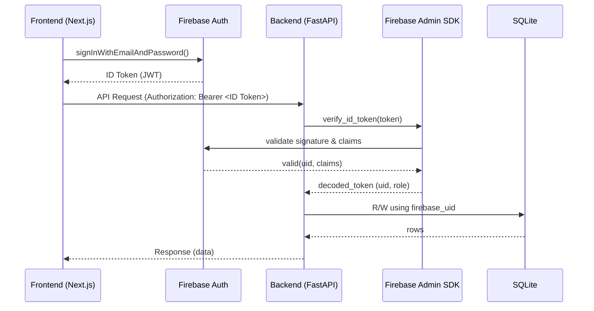

## Firebase Authentication 移行プラン

### 背景 / 現状
- フロントエンド `frontend/src/app/login/page.tsx` はダミー認証（`admin/password`）で `localStorage` にダミートークン保存。
- バックエンド `backend/main.py` は SQLite（`test.db`）で `users` テーブルを管理。パスワード列は無し。認証/認可は未実装。

### 目的
- 認証は Firebase Authentication に委譲（Email/Password など）。
- フロントは Firebase でログインし、取得した ID トークンを API 呼び出しに付与。
- バックエンドは Firebase Admin SDK で ID トークンを検証し、APIを保護。
- DB にはアプリ独自のユーザー属性と Firebase UID の紐付けのみを保持。

### 導入範囲（最小）
- フロントのログイン/ログアウト/サインアップを Firebase 化。
- 書き込み系 API（例: `POST /users/`, `POST /user_results/` など）を Firebase ID トークン必須に。
- `users` テーブルへ `firebase_uid` 列を追加し、ユーザーと UID を一意に紐付け。

---

## 手順

### 1) Firebase プロジェクト準備
1. Firebase Console でプロジェクト作成（既存があれば再利用）。
2. Authentication を有効化（Email/Password 他必要なプロバイダ）。
3. Web アプリを追加し、`apiKey`, `authDomain`, `projectId` などの設定値を取得。
4. サービスアカウントキー（JSON）を作成・ダウンロード（バックエンド検証で使用）。

### 2) フロントエンド実装（Next.js）
1. 依存追加
   ```bash
   cd frontend
   npm install firebase
   ```
2. Firebase 初期化モジュールを作成（例: `src/lib/firebase.ts`）。
3. ログイン/サインアップを Firebase Auth に差し替え
   - `signInWithEmailAndPassword`, `createUserWithEmailAndPassword` を使用。
   - 成功時に `getIdToken()` で ID トークン取得。
4. API 呼び出しに ID トークンを付与
   - Fetch/Axios インターセプタを用意し、`Authorization: Bearer <idToken>` を自動付与。
5. 認可ガード
   - `onAuthStateChanged` でログイン状態を購読し、保護ページは未ログイン時 `/login` にリダイレクト。
6. 環境変数（例）
   - `NEXT_PUBLIC_FIREBASE_API_KEY`
   - `NEXT_PUBLIC_FIREBASE_AUTH_DOMAIN`
   - `NEXT_PUBLIC_FIREBASE_PROJECT_ID`
   - 既存: `NEXT_PUBLIC_API_BASE_URL`

### 3) バックエンド実装（FastAPI）
1. 依存追加
   ```bash
   cd backend
   pip install firebase-admin
   ```
2. 起動時に Firebase Admin を初期化
   - サービスアカウント JSON をファイルまたは環境変数で安全に読み込む。
3. 認証依存関数の追加
   - `Authorization: Bearer <idToken>` を抽出し、`firebase_admin.auth.verify_id_token` で検証。
   - 検証成功時に `firebase_uid`（`uid`）を返す。
4. エンドポイント保護
   - 書き込み系から段階的に `Depends(verify_firebase_token)` を適用。
5. ロール/権限（必要に応じて）
   - Firebase Custom Claims を付与し、検証時に読み取り→エンドポイントで権限チェック。

### 4) DB スキーマ変更（SQLite / SQLAlchemy）
1. `users` へ列追加
   - `firebase_uid TEXT` を追加（当初は `NULL` 許容）。
   - 一意制約・インデックスを作成（`UNIQUE`/`INDEX`）。
2. SQLAlchemy モデル更新
   - `firebase_uid = Column(String, unique=True, index=True, nullable=True)` を追加。
3. マイグレーション
   - シンプルな `ALTER TABLE` と `CREATE INDEX` のスクリプトを用意し一度実行。

### 5) 既存データの扱い / 紐付け
- 現行 DB はパスワード未保持のため、移行は UID 紐付け中心。
- 戦略
  - 新規ログイン（Firebase ユーザー作成）後、フロントから `/users/` 作成・更新時に `firebase_uid` を保存。
  - 既存ユーザーを事前作成済みなら、メール等のキーがある場合は管理用 API で UID を突合し埋め込み。
- 段階導入
  - 初期は検証ログのみ出力→動作確認→保護を必須化。

### 5.1) ロール設計（user / admin）
- 目的: 画面/機能レベルでの権限制御（例: 管理画面・ユーザー管理は admin のみ）。
- 付与方法: Firebase Custom Claims を利用し、ユーザーに `{ role: 'admin' | 'user' }` を割り当て。
  - 付与はサーバー側（管理用スクリプト or 保護された管理 API）で実行。
  - 例: `auth.setCustomUserClaims(uid, { role: 'admin' })`。
- トークン反映: Custom Claims 変更後はユーザー側で再ログイン or `getIdToken(true)` で更新。
- バックエンド検証: ID トークン検証後に `decoded_token.get('role')` を取得し、エンドポイントで分岐。
  - 例: 管理系 API は `role == 'admin'` のみ許可、それ以外は `403 Forbidden`。
- フロント制御: ルーティング/メニュー表示を `role` に基づき出し分け（表示/非表示と URL ガード）。

### 6) セキュリティ / 運用
- CORS: 開発時は緩め、本番は許可オリジンを限定。
- トークン更新: フロントで `onIdTokenChanged` を購読し、常に最新を送信。
- ログ/監視: 検証失敗理由（期限切れ、署名不正等）を記録。
 - ロール管理: Custom Claims の付与・変更は監査ログを残し、管理者のみ操作可能にする。

### 7) 撤去
- フロントのダミー認証ロジックを削除。
- README を更新（環境変数、起動手順、動作フロー）。

---

## 実装順序（例）
1. Firebase 準備・鍵配置・環境変数設定。
2. フロントに Firebase を導入し、ログイン/ログアウト/サインアップ実装。
3. バックエンドに Admin SDK を導入、ID トークン検証依存を追加、書き込み系 API を保護。
4. `users` に `firebase_uid` 列を追加し、作成/更新で UID を保存。
5. 必要に応じて読み取り系も保護、ロール/権限があれば Custom Claims 導入。
6. ダミー認証撤去、動作確認、ドキュメント更新。

---

## 環境変数例
フロント（`.env.local`）
```env
NEXT_PUBLIC_FIREBASE_API_KEY=xxxxx
NEXT_PUBLIC_FIREBASE_AUTH_DOMAIN=yourapp.firebaseapp.com
NEXT_PUBLIC_FIREBASE_PROJECT_ID=your-project-id
NEXT_PUBLIC_API_BASE_URL=http://localhost:8000
```

バックエンド（`.env` など）
```env
GOOGLE_APPLICATION_CREDENTIALS=/secure/path/service-account.json
# または
FIREBASE_CREDENTIAL_JSON={...サービスアカウントJSON...}
```

---

## チェックリスト
- [ ] フロント: Firebase SDK 初期化、ログイン/サインアップ/ログアウト。
- [ ] フロント: API 呼び出しで ID トークン自動付与。
- [ ] バックエンド: Admin SDK 初期化、ID トークン検証依存。
- [ ] API 保護: 書き込み系エンドポイントでトークン必須化。
- [ ] DB: `firebase_uid` 列追加、ユニーク制約/インデックス作成。
- [ ] ユーザー作成/更新時に UID 保存。
- [ ] ロール/権限（必要時）を Custom Claims で実装。
- [ ] 管理系 API/画面は `admin` のみ許可、一般機能は `user` 以上。
- [ ] フロントのナビ/ルーティングをロールで出し分け。
- [ ] ダミー認証撤去、README 更新。

---

## アーキテクチャ図（Mermaid）

### 構成関係（コンポーネント）


### 主要フロー（ログイン→API呼び出し）



